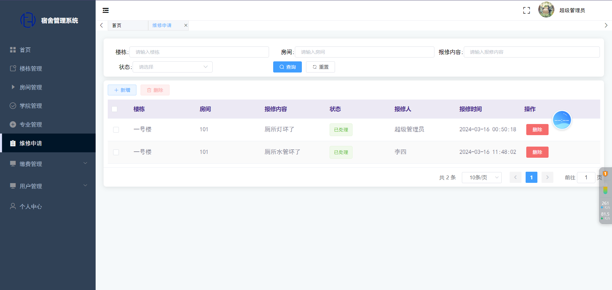
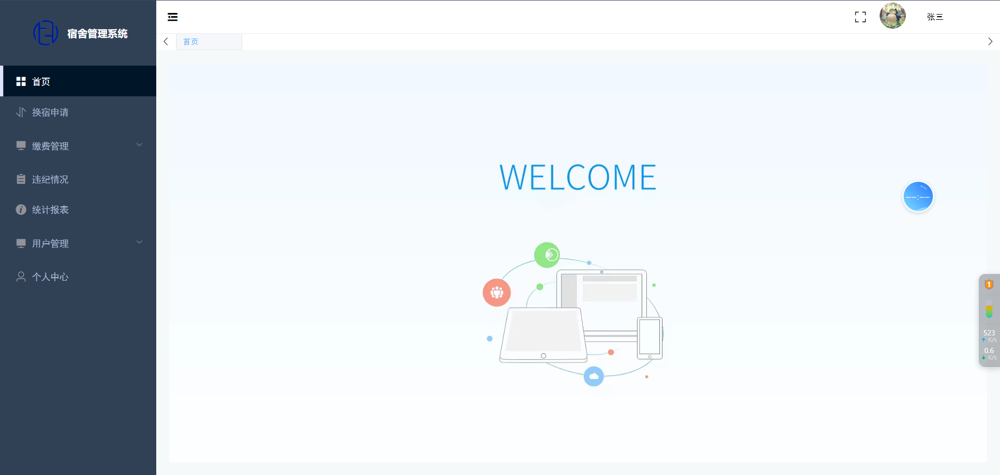
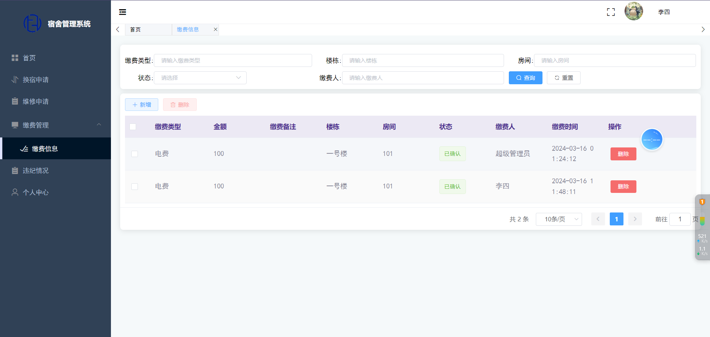

# SpringBoot+Vue的宿舍管理系统

**有问题或获取源码可以咨询企鹅Q1760272627** 

**系统运行视频：**  https://www.bilibili.com/video/BV1iu4m1T7aV/

### 功能：
分为管理员，宿管员，学生三个角色，包含换宿申请、个人信息、维修申请、宿舍缴费、违纪情况、学生管理、宿管员管理、维修管理，统计报表等功能

### 采用技术：
SpringBoot，shiro，Mybatis-plus，Vue，redis，mysql，ElementUi，echarts

### 工具：
idea，vscode，navicat

### 功能结构：

### 系统截图：

**有问题或获取源码可以咨询企鹅Q1760272627** 
